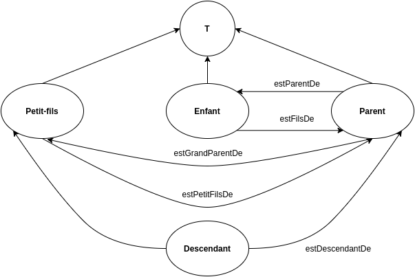

# WEB3.0_TEA02 - Ontologie et Logiques de description

### ANTELME Mathis

## Exercice 1

> 1. Identifier la **T-Box** et la **A-Box**;

Ici, la **T-Box** correspond à la définition des propriétés et des classes. La **A-Box**, elle, correspond aux données (la suite de l'annexe).

> 2. Pourquoi l'existance d'un humain `unknown` est-elle nécessaire ?

Un humain `unknown` permet de définir le concept d'humain dans son ensemble (plus générique), on appelle cela la *subsomption*.

## Exercice 2

> 1. Montrez que la vache folle est un concept inconsistant;

```
VacheFolle ≡ Vache∃mange.Mouton
VacheFolle ≡ Vache∃mange.Mouton ⊑ Animal
VacheFolle ≡ Animal ⊓ Vegetarien ∃mange.Mouton ⊑ Animal
VacheFolle ≡ Animal ⊓ ∀mange.¬Animal ∃mange.Mouton ⊑ Animal
```

> 2. Montrer qu’il existe des animaux non végétariens;

```
VacheFolle ≡ Vache∃mange.Mouton
VacheFolle ≡ Vache∃mange.Mouton ⊑ Animal
```

## Exercice 3

> Donner les formules logiques d´ecrivant les concepts suivants:

- Un homme est un humain;
- Une femme est un humain;
- Un homme n'est pas une femme et vice-versa;
- Une équipe est définie par un set d'au minimum 2 membres humains;
- Une petite équipe est définie comme une équipe d'au maximum 5 membres;
- Une équipe moderne est définie comme une petite équipe comportant au moins un leader, qui correspond à un membre, et tout les leaders sont des femmes;

```
Man ⊑ Human
Woman ⊑ Human
∀ ¬Man = Woman, ∀ ¬Woman = Man
Team ≡ >2 ∀member ⊑ Human
SmallTeam ≡ Team ⊓ (≤ 5.Member)
Leader≡ Member
ModernTeam ≡ SmallTeam ∃Leader : ∀Leader ⊑ Woman
```

## Exercice 4

> On considère l’ontologie suivante, extraite d’une ontologie touristique:

```xml
<owl:Class rdf:ID="Activite" /><owl:Class rdf:ID="ActiviteSportive">
    <rdfs:subClassOf rdf:resource="#Activite" />
</owl:Class><owl:Class rdf:ID="SejourActif">
    <owl:equivalentClass>
        <owl:Restriction>
            <owl:someValuesFrom rdf:resource="#Activite" />
            <owl:onProperty>
                <owl:ObjectProperty rdf:ID="activites" />
            </owl:onProperty>
        </owl:Restriction>
    </owl:equivalentClass>
</owl:Class><owl:Class rdf:ID="SejourSportif">
    <owl:equivalentClass>
        <owl:Restriction>
            <owl:onProperty rdf:resource="#activites" />
            <owl:allValuesFrom rdf:resource="#ActiviteSportive" />
        </owl:Restriction>
    </owl:equivalentClass>
</owl:Class>
```

> 1. Représenter cette ontologie sous forme d’expressions logiques;

```
ActiviteSportivie ⊑ Activite
SejourActif ≡ ∃activites.Activite
SejourSportif ≡ ∀activites.ActivitesSportive
```

> 2. Est-ce que `SejourSportif` est un sous concept de `SejourActif` ? Pourquoi ?

La définition de `SejourActif` est différente de celle de `SejourSportif`. En effet, ces deux concepts ne sont pas définis l'un par rapport à l'autre et leurs relations aux autres propriétés de `activité` n'ont pas la même cardinalité. On peut donc en conclure que `SejourSportif` n'est pas un sous-concept de `SejourActif`.

## Exercice 5

> 1. Les relations suivantes peuvent se d´eduire des relations et concepts atomiques. Donner une formule logique les décrivant:

- estFrereDe(X,Y) et estSoeurDe(X,Y);
- estPetitFilsDe(X,Y) et EstPetiteFilleDe(X,Y);
- EstDescendant(e)De (X,Y);

```
estFrereDe(X,Y) = (X ⊆ Homme) ^ (Y ⊆ Humain) ^ (Parent ⊆ Humain) ^ (X estFilsDe Parent) ^ (Y estFilsDe ∪ estFilleDe Parent)
estSoeurDe(X,Y) = (X ⊆ Femme) ^ (Y ⊆ Humain ) ^ (Parent ⊆ Humain) ^ (X estFilleDe Parent) ^ (Y estFilleDe ∪ estFilsDe Parent)
estPetitFilsDe(X,Y) ⊆ (X ⊆ Homme) ^ (Y ⊆ Humain ) ^ (Parent ⊆ Humain) ^ (X estFilsDe(Parent)) ^ (Parent estFilsDe(Y))
estPetiteFilleDe(X,Y) ⊆ (X ⊆ Femme) ^ (Y ⊆ Humain ) ^ (Parent ⊆ Humain) ^ (X estFilleDe(Parent)) ^ (Parent estFilsDe(Y))
EstDescendant(e)De (X,Y) ≡ estPetitFilsDe(X,Y) ≡ estPetiteFilleDe(X,Y) ≡ estFilsDe(X,Y) ≡ estFilleDe(X,Y)
```

> 2. Représenter graphiquement la **T-Box** de cette ontologie;



> 3. Quelles sont les caractéristiques des relations (transitivité, symétrie, inverse, restriction de cardinalité ...) ? En deduire la logique descriptive associée;

- estFilsDe(X,Y) ≡ ParentDe(X,Y)⁻⁻
- estFilleDe(X,Y) ≡ ParentDe(X,Y)⁻⁻
- estFilsDe(X,Y)⁺ ⊆ estDescendant(e)De(X,Y)
- estFilleDe(X,Y)⁺ ⊆ estDescendant(e)De(X,Y)
- estPetitFilsDe(X,Y)⁺ ⊆ estDescendant(e)De(X,Y)
- estPetiteFilleDe(X,Y)⁺ ⊆ estDescendant(e)De(X,Y)